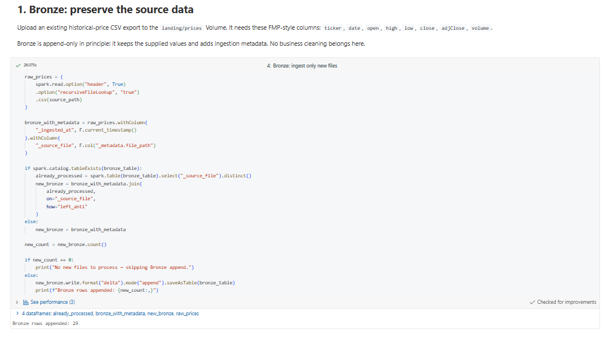
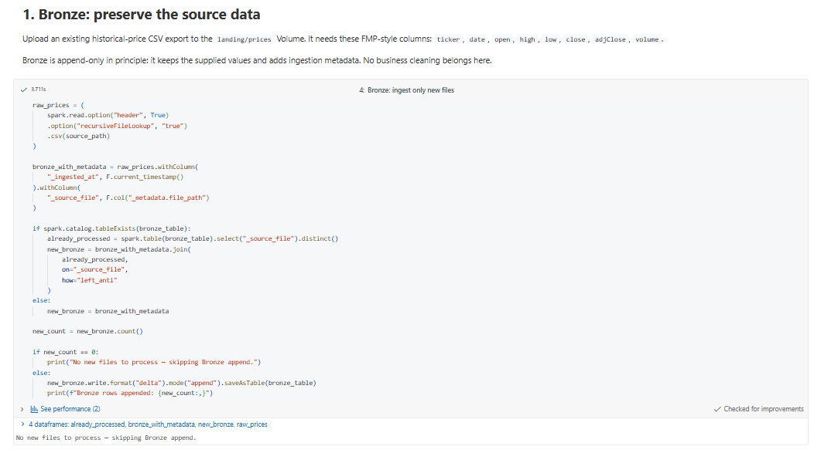
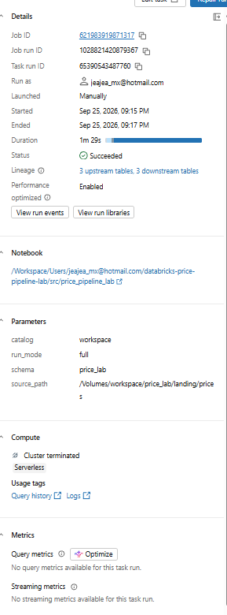
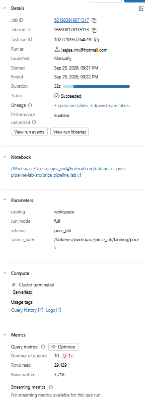
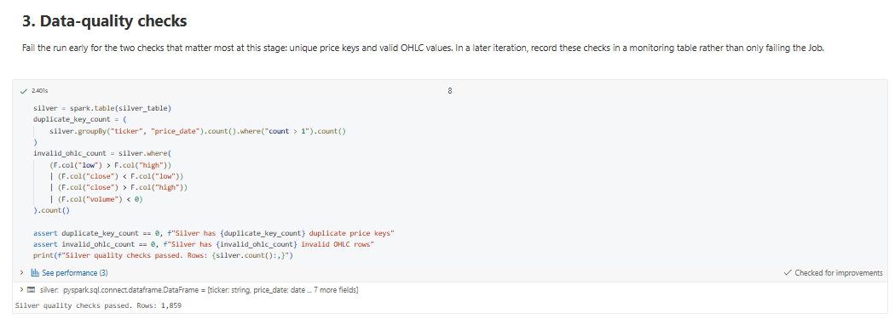
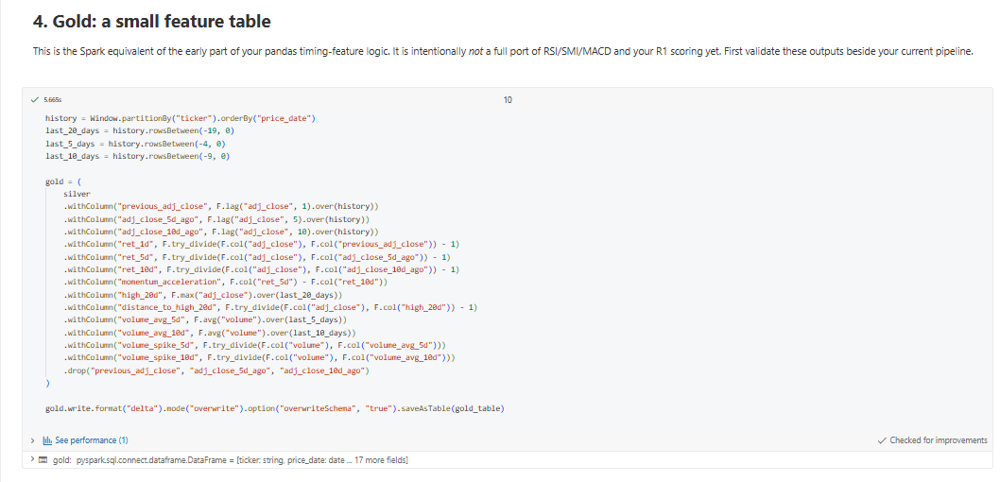

# Databricks Price Pipeline Lab

A hands-on data-engineering project that migrates a small historical price pipeline to Databricks Serverless using PySpark, Delta Lake, Unity Catalog, Databricks Workflows, and GitHub.

The pipeline ingests CSV price files from a Unity Catalog Volume and produces cleaned daily prices and analysis-ready timing features.

## Architecture

```text
CSV files in Unity Catalog Volume
        ↓
Bronze Delta: raw prices + ingestion metadata
        ↓
Silver Delta: typed, validated, deduplicated daily prices
        ↓
Gold Delta: returns, momentum, high and volume features
        ↓
Analysis / dashboards / ML models
```

## Technology

- Databricks Serverless
- PySpark
- Delta Lake
- Unity Catalog
- Databricks Workflows
- GitHub and Git-backed Databricks development

## Data flow

### Bronze — `workspace.price_lab.bronze_price_raw`

Bronze preserves the raw CSV data and adds ingestion metadata:

- `_ingested_at` — timestamp when Databricks ingested the data
- `_source_file` — source file path from `_metadata.file_path`

The pipeline uses file-once ingestion. Previously processed source files are skipped on later runs, preventing duplicate Bronze ingestion.

### Silver — `workspace.price_lab.silver_price_daily`

Silver standardises the raw price data:

- normalises ticker symbols;
- parses multiple date formats;
- casts prices and volume to appropriate types;
- filters invalid records;
- keeps one row per `ticker` and `price_date`;
- uses a Delta `MERGE` to update existing keys and insert new ones.

### Gold — `workspace.price_lab.gold_price_timing_features`

Gold provides downstream-ready price features, including:

- 1-day, 5-day, and 10-day returns;
- momentum acceleration;
- 20-day high and distance from that high;
- 5-day and 10-day average volume;
- volume-spike ratios.

## Data-quality checks

The pipeline fails early if Silver contains:

- duplicate `ticker` and `price_date` keys;
- `low > high`;
- a close price outside the daily low/high range;
- negative volume.

## Running the pipeline

The Databricks Workflow is named `price_pipeline_daily` and runs the Git-backed notebook on Serverless compute.

| Parameter | Default |
|---|---|
| `catalog` | `workspace` |
| `schema` | `price_lab` |
| `source_path` | `/Volumes/workspace/price_lab/landing/prices` |
| `run_mode` | `full` |

`full` ingests new source files and runs all transformations.

`transform_only` rebuilds Silver and Gold without ingesting files again.

## Execution evidence

### New-file Bronze ingestion

A new price file was detected and appended to the Bronze Delta table.



### File-once Bronze ingestion

A repeat run detected that no new source files existed and safely skipped the Bronze append.



### Successful Databricks Workflow run

The Git-backed notebook completed successfully on Databricks Serverless.



### Repeat Workflow run

A second successful Workflow run confirms the pipeline is safe to rerun after all files have been processed.



### Silver data-quality checks

Silver validation passed after the incremental load.



### Latest Gold features

The Gold Delta table contains the newly processed latest price date and derived timing features.



## Repository structure

```text
src/
  price_pipeline_lab.py

docs/
  screenshots/
    Bronze_run.png
    Bronze_NoNewData.png
    Run_Stats.png
    Run_Stats_NoNewData.png
    DQ_Checks.png
    Gold.png
```

## Notes

This is a personal learning project built with sample historical price data. No credentials, production data, or proprietary code are included.
